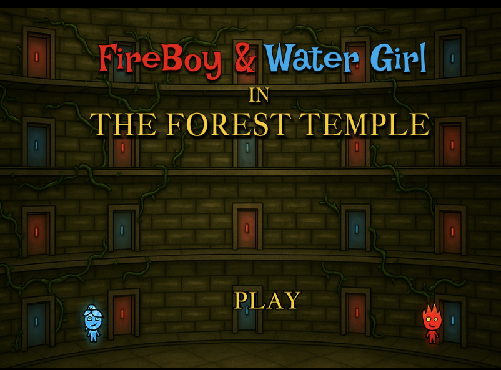
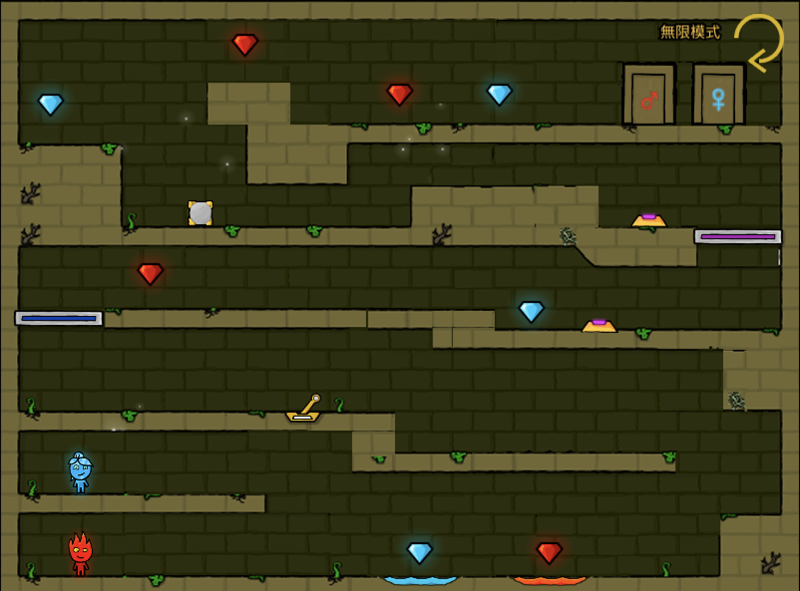
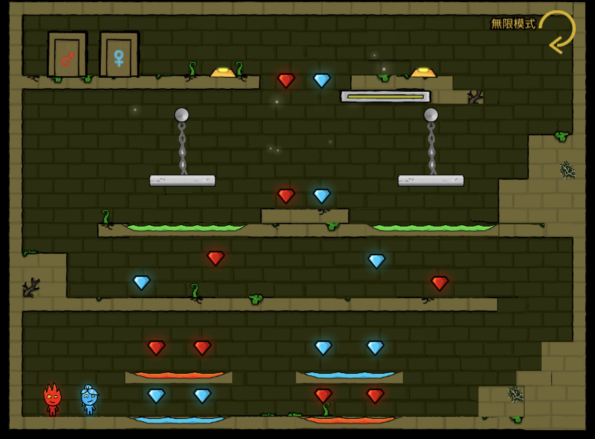
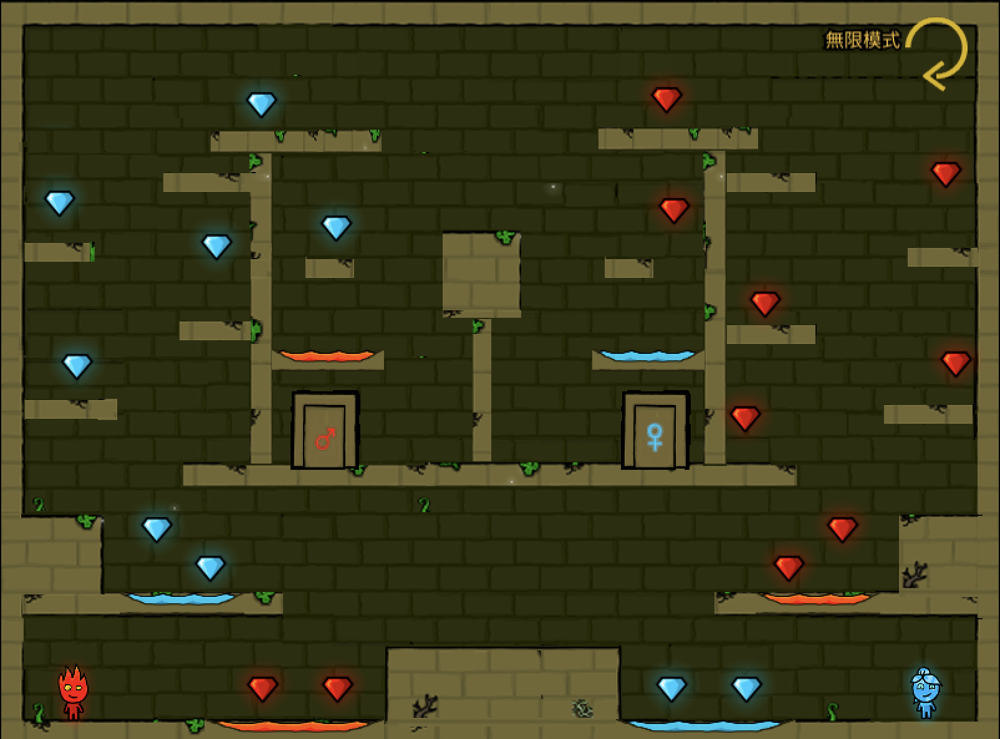
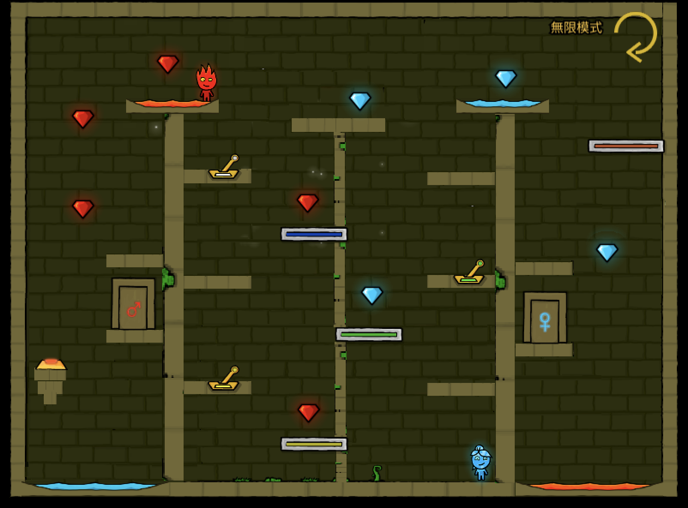
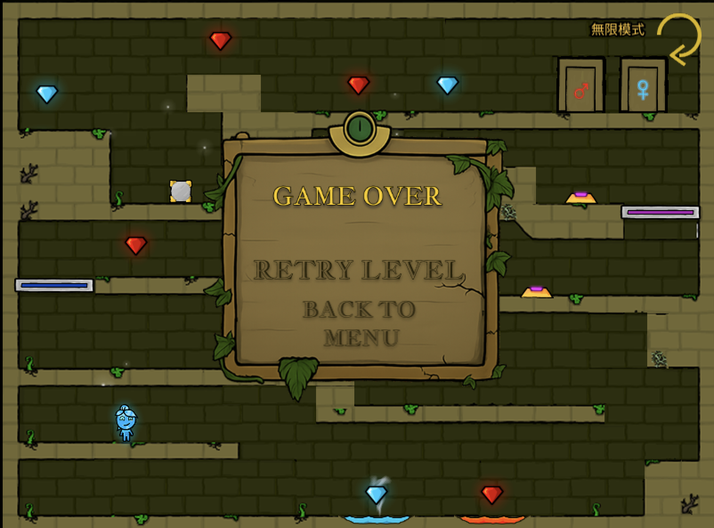
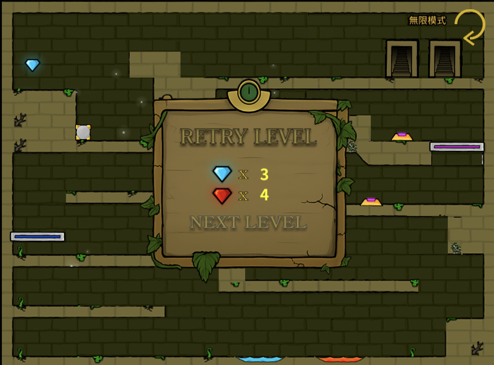

# 2025 OOPL Final Report

## 組別資訊

組別：12  組員：張孟綺 112590014 復刻遊戲： 冰火姐弟

## 專案簡介

### 遊戲簡介

該遊戲主要在復刻經典的童年雙人遊戲「冰火姐弟」。

* 角色為火弟弟與冰姐姐，兩人合力經過各種機關以完成闖關。
* 機關包含：利用搖桿、按鈕控制升降梯，跳過與自身屬性不同的冰河、火河、沼澤，走過平衡吊橋。
* 共設計 4 個關卡。

### 組別分工

一人實作專案，涵蓋找素材、修圖、架構設計與撰寫程式、測試與除錯等工作。

## 遊戲介紹

### 遊戲規則

右上按鈕：

無限模式：點擊無限模式按鈕為true後，可以讓玩家具作弊模式。

重新開始：點擊重新開始圖示按鈕，可以讓玩家重玩遊戲。

**角色操控：**

* 冰姐姐操控鍵為 WAD：

  W（跳躍）、A（左移平移）、D（右移平移）、WA（左上跳躍）、WD（右上跳躍）
* 火弟弟操控鍵為方向鍵：

  ↑（跳躍）、←（左移平移）、→（右移平移）、↑←（左上跳躍）、↑→（右上跳躍）

**得分辦法：**

    有紅、藍兩種寶石。火弟弟吃到紅寶石便會得分｜冰姐姐吃到藍寶石便會得分

**死亡機制：**

當冰姐姐、火弟弟任一角色觸犯遊戲規範時（如：冰姐姐掉入火海、火弟弟掉入冰河、任一角色掉入沼澤）就會死亡。

**過關機制：**

1. 人物可透過推桿、按鈕來控制升降梯的水平跟垂直移動。
2. 岩石能幫助人物在兩階層高度落差太大時，起到減少垂直距離的作用。
3. 當人物距離吊橋中心太遠時，會從吊橋掉落。

透過上述2點機制，以達到闖關門。當冰姐姐與火弟弟同時進入屬於自己顏色的門中，便會開啟門以完成闖關。

### 遊戲畫面

**起始頁面**

**第一關**

**第二關**

**第三關**

**第四關**

**人物死亡觸發Stage畫面**

**人物過關**

## 程式設計

### 程式架構

1. 遊戲角色 (Actors)

   - NewCharacter：基礎角色類別
   - NewFireboy：火人角色
   - NewWaterGirl：冰人角色
   - NewRock：岩石物件
2. 頁面管理 (Pages)

   - IntroductionPage：遊戲介紹頁面
   - FirstLevel 到 FourthLevel：四個遊戲關卡
3. 遊戲機制 (Machines)

   - 包含各個遊戲機關
4. 應用程式管理 (App)

   - 負責管理遊戲狀態
   - 程式技術
5. 物件導向程式設計

   - 使用繼承實現角色系統
   - 使用多型處理不同類型的遊戲物件
   - 封裝遊戲邏輯和資料
6. 記憶體管理

   - 使用 `shared_ptr` 來管理物件的生命週期
   - 避免 Memory Leak
7. 遊戲循環

   - 實現遊戲循環：Start -> Update -> End
   - 使用狀態管理遊戲進程

## 結語

### 問題與解決方法

* 記憶體管理

問題：在未設計重置關卡的功能時，沒有做針對使用完的記憶體做釋放，導致多次重置同一關卡時遊戲的整體效能變得非常慢

解決方法：多次重置同一個關卡後，發現人物的移動變得很遲緩，故針對整體架構做思考後發現是沒有清空使用完的 shared_ptr。因此，我將每個物件進行 `reset`，同時 `Start()` 初始化的地方將物件加入 `stash`，以便遊戲結束、重置時可以利用 `for` 將物件從畫面中移除；另外，針對用到的 `vector` 也要做到清除的動作（使用 `clear()`）。這確保遊戲能夠重新初始化、避免效能問題與記載上一次遊戲所殘留的錯誤資料。

* Circular Dependency

問題：NewFireboy 和 NewWaterGirl 都繼承自 NewCharacter，且使用相同的 Function，因此希望將共用的 Function 放在父類 NewCharacter。由於在 NewDoor 與其他機關中也呼叫到 NewCharacter，導致雙向呼叫發生 Circular Dependency。

解決方法：我查過一些資料，發生該問題時應視情況而決定更動的大小。目前已知的做法有二，前項宣告、使用介面。

**做法一：**

這邊我使用的是「前項宣告」，它的定義是不直接 include 該資料型態，使用「前項宣告」，避免直接 `include` 資料型態，而是先宣告該 class，，讓 compiler 不會去 include 該 class，從而避開 Circular Dependency 的檢測。之所以會使用「前項宣告」的原因是因為這邊的 Function 不多，所以不打算將方法獨立抽出做成一個 Interface。

**做法二：**

將會造成 Circular Dependency 的 Function 提取為 Interface，讓兩個 class 繼承該 Interface 避免雙向呼叫（類似 USB 接口和電腦插口的關係）。

* 跳躍事件

問題：當一直壓著W或UP時，人物就會一直觸發跳躍事件，導致人物的頭部會貼著平台的天花板。

解決方法：將 `Util::Input::IsKeyPressed(Util::Keycode::UP)` 改為 `IsKeyDown()`，避免一直觸發。`IsKeyPressed` 是只要按著就會重複觸發；`IsKeyDown` 則是按下那一刻才觸發。

* 碰撞項檢測、架構

問題：在我的第一版碰中，針對平台部分只有做左右平移的檢測，這會導致當人物實施Jump()方法時頭部會穿過平台。另外，檢測碰撞像的地方因為是寫在Update所以如果要做後續管理會非常不便。

解決方法：我refactor程式的整體架構，新增一個專門在處理人物的類別 NewCharacter，該類別的成員包含 `startpos` 與 `tag`，用在Start() 初始化人物的屬性與位置。而方法的部分，建構 `IsCollidingWithPlatform()`檢測人物與平台的碰撞，並針對X軸和Y軸分別建構了兩個 Function 去檢測人物與平台的碰撞。將碰撞項放在基底寫，並使用虛擬函式就可以實現方便管理且自定義可變內容。

### 自評

| 項次 | 項目                                     | 完成 |
| ---- | ---------------------------------------- | ---- |
| 1    | 這是範例                                 | V    |
| 2    | 完成專案權限改為 public                  | V    |
| 3    | 具有 debug mode 的功能                   | V    |
| 4    | 解決專案上所有 Memory Leak 的問題        | V    |
| 5    | 報告中沒有任何錯字，以及沒有任何一項遺漏 | V    |
| 6    | 報告至少保持基本的美感，人類可讀         | V    |

### 心得

獨立建構一個小專案真的可以學到很多東西，尤其是針對自己不太熟悉的領域。藉由這次實作，終於理解了很多上學期 oop 的內容，包括封裝、繼承、介面和智慧指標等。和上學期不同的是，該專案需要非常清楚地瞭解遊戲的需求與功能面，而學會一套概念要加以使用才是真正的學問。過程中最大的收穫就是邊做邊學且不斷思考之後的擴充性該如何，還記得一開始實作的水平碰撞項成功後，我認為那就是很棒的功能了，但卻低估了後續程式的擴充性，因此決定打掉重練。因為我希望每一關的建構方式都能更容易管理，這讓我體悟到「做中學」的過程，能對看待事情的角度產生很大的影響。而遇到問題時應該先瞭解造成問題發生的原因，進而思考可解決的方式。方式與技巧並無優劣，應該是要依照當前的需求即使用的場景來決定要使用何種方法解決問題。最後，因為製作專案期間很常會出現編譯器報錯的提示，我更加熟悉查看報錯指令，並依照該提示去找相對應的解決方式。整體來說，非常受益良多且學到很多新鮮的概念與領域，且更為熟悉 C++ 的使用。最後，誠摯感謝我的好友謝博任跟楊子毅給的諸多建議，讓我在實作上更有方向，也完成了我小時候最愛玩的遊戲！

### 貢獻比例

張孟綺 100%
